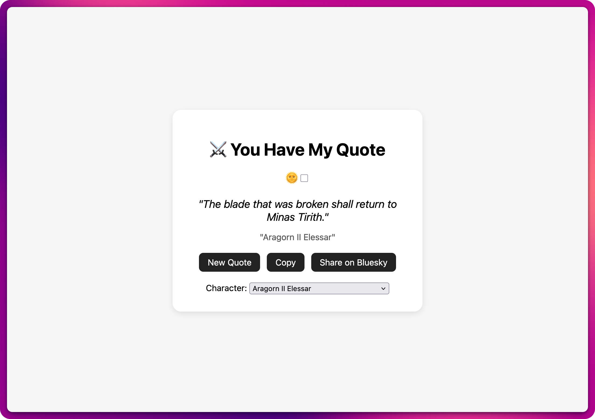
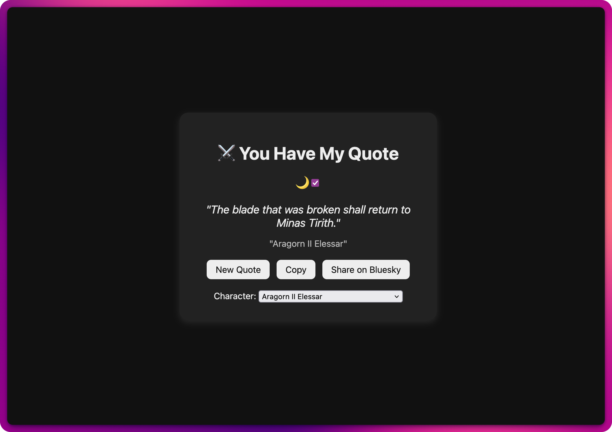

# You Have My Quote 💬✨

A minimalist quote generator that delivers bite-sized wisdom, humor, and inspiration — built with vanilla JavaScript, HTML, and CSS.

## ✨ Features

- Random quotes with category filtering (e.g., wisdom, motivation, humor)
- Dark/Light mode toggle 🌞🌙
- Smooth quote transition animations
- Copy to clipboard & share on Bluesky
- Mobile-friendly and accessible

## 🔗 Live Demo

👉 [Try You Have My Quote](https://danpgomez.github.io/yhmq/)

## 📸 Screenshots

  
  

## 🛠️ Tech Stack

- HTML5 / CSS3
- Vanilla JavaScript
- Responsive design

## 🔮 Planned Enhancements

- User-submitted quotes
- Favorite quote saving with localStorage
